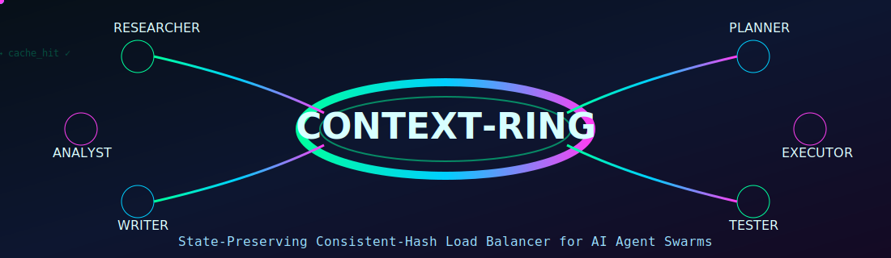

# Context-Ring

> **State-Preserving Consistent-Hash Load Balancer for AI Agent Swarms**

[](https://www.python.org/)
[](https://fastapi.tiangolo.com/)
[](LICENSE)

---

## The Problem

When building agent swarms with frameworks like **CrewAI**, **AutoGen**, or **LangGraph**, agents spin up and down to handle dynamic workloads. A standard load balancer routes each incoming prompt to a random node, causing every new agent to reload thousands of context tokens from scratch — paying full price on every turn.

| Scenario | Standard Load Balancer | Context-Ring |
|---|---|---|
| Session turn 1 | Agent A loads context | Agent A loads context |
| Session turn 2 | **Agent C** — cold start, full reload | **Agent A again** — cache hit |
| Session turn 10 | 10× full context loads | 1× context load |
| Agent node crashes | All sessions rerouted | Only 1/N sessions remapped |

---

## The Solution

Context-Ring is a **production-grade reverse proxy** that places session IDs and agent virtual nodes onto a **consistent hash ring**. Prompts from the same long-running task are deterministically routed to the exact same agent instance that already holds the chat history in local memory.

```
[ Incoming Prompt ]
       │
       ▼
┌─────────────────────┐
│  Context-Ring Proxy │ ──► hash(session_id)  [MurmurHash3, O(1)]
└─────────────────────┘
       │
  O(log N) BST lookup
       │
       ▼
[ Consistent Hash Ring ]
  ├── agent-1  (vnode_0 … vnode_127)
  ├── agent-2  (vnode_0 … vnode_127)  ◄── target (clockwise nearest)
  └── agent-3  (vnode_0 … vnode_127)
       │
       ▼
┌─────────────────────┐
│  Dedicated Agent    │ ──► Context cache HIT ✓
└─────────────────────┘
```

### Key Properties

- **Deterministic routing** — same `session_id` always maps to the same agent node.
- **Graceful scaling** — adding or removing one node remaps only **1/N** of sessions, not all of them.
- **Token cost reduction** — eliminates redundant context-window reloads on OpenAI, Claude, Gemini, and any other LLM API.
- **Streaming passthrough** — full SSE / chunked-transfer streaming support.
- **Zero state transfer** — agents are stateless from the proxy's perspective; state lives in their local memory.

---

## Architecture

```
┌───────────────────────────────────────────────────────────────────┐
│                        Context-Ring Proxy                         │
│                                                                   │
│  FastAPI (ASGI)  ──►  SecurityMiddleware  ──►  RingManager        │
│                                                    │              │
│                                              ConsistentHashRing   │
│                                            (mmh3 + bisect BST)    │
│                              ┌─────────────────────┘              │
│                              │  asyncio.Lock (thread-safe)        │
│                              │  Redis pub/sub (gossip sync)       │
└──────────────────────────────┼────────────────────────────────────┘
                               │
              ┌────────────────┼────────────────┐
              ▼                ▼                ▼
        agent-worker-1   agent-worker-2   agent-worker-3
         (port 8001)      (port 8001)      (port 8001)
```

### Tech Stack

| Component | Choice | Why |
|---|---|---|
| Web framework | **FastAPI + asyncio** | Non-blocking ASGI; sub-ms routing overhead |
| Hash function | **MurmurHash3 (mmh3)** | ~3× faster than SHA-256; excellent uniformity |
| Ring data structure | **Sorted list + bisect** | O(log N) clockwise lookup; pure Python |
| State sync | **Redis pub/sub** | Gossip-pattern node membership across proxy replicas |
| HTTP client | **httpx (async)** | Native async streaming proxy with connection pooling |
| Containerisation | **Docker + Compose** | Zero-config local stack; production-ready |

---

## Project Structure

```
context-ring/
├── src/
│   ├── __init__.py               # Package exports
│   ├── ring.py                   # ConsistentHashRing — core algorithm
│   ├── manager.py                # RingManager — async façade + Redis sync
│   ├── main.py                   # FastAPI app — proxy endpoints + observability
│   └── security.py               # Auth, rate limiting, session HMAC, headers
│
├── tests/
│   ├── conftest.py               # Shared fixtures, env setup
│   ├── test_ring.py              # Unit tests: hash, routing, distribution
│   ├── test_proxy.py             # Integration tests: FastAPI endpoints
│   ├── test_security.py          # Unit tests: auth, rate limiting, HMAC
│   └── test_manager.py           # Redis integration tests (skipped without Redis)
│
├── scripts/
│   ├── admin.py                  # CLI: register, deregister, status, route, health
│   ├── benchmark.py              # Performance benchmarks: hash, routing, distribution
│   ├── healthcheck.sh            # Docker HEALTHCHECK script
│   └── load_test.py              # Locust load-test scenario
│
├── examples/
│   ├── crewai_integration.py     # CrewAI agent swarm wiring example
│   └── langgraph_integration.py  # LangGraph StateGraph wiring example
│
├── k8s/
│   ├── deployment.yaml           # Deployment, Service, ServiceAccount, HPA
│   ├── configmap.yaml            # ConfigMap + Secret template
│   └── ingress.yaml              # nginx-ingress with TLS, streaming, rate limits
│
├── docker/
│   └── prometheus.yml            # Prometheus scrape config
│
├── .github/
│   └── workflows/
│       └── ci.yml                # GitHub Actions: lint → test → docker → publish
│
├── Dockerfile                    # Multi-stage production image (non-root)
├── docker-compose.yml            # Full local stack: proxy + agents + Redis + Prometheus
├── Makefile                      # Dev tasks: setup, test, lint, docker, bench, seed
├── pyproject.toml                # Pytest, Ruff, Mypy configuration
├── requirements.txt              # Production dependencies
├── requirements-dev.txt          # Dev + test dependencies
├── .env.example                  # Environment variable reference
├── .gitignore
├── LICENSE                       # MIT
└── README.md
```

---

## Quick Start

### Prerequisites

- Docker 24+ and Docker Compose v2
- Python 3.11+ (for local development)

### 1. Clone and configure

```bash
git clone https://github.com/david-spies/context-ring.git
cd context-ring
cp .env.example .env
# Edit .env — set CONTEXT_RING_API_KEY to a strong random value
```

### 2. Start the full stack

```bash
docker compose up --build
```

This starts:
- `context-ring-proxy` on **:8000**
- 3 × `agent-worker` mock nodes
- `redis` for state synchronisation

### 3. Send your first request

```bash
# Route a chat completion (session_id in JSON body)
curl -X POST http://localhost:8000/v1/chat/completions \
  -H "Content-Type: application/json" \
  -d '{
    "session_id": "user-abc-123",
    "model": "gpt-4o",
    "messages": [{"role": "user", "content": "Hello"}]
  }'

# Or via header
curl -X POST http://localhost:8000/v1/chat/completions \
  -H "X-Session-ID: user-abc-123" \
  -H "Content-Type: application/json" \
  -d '{"model": "gpt-4o", "messages": [...]}'
```

The proxy injects three headers into every forwarded request:
- `X-Context-Ring-Node` — which agent received this request
- `X-Context-Ring-Hash` — the MurmurHash3 hex of the session ID
- `X-Context-Ring-Vnode` — the matched virtual node index

---

## API Reference

### `POST /v1/chat/completions`

Route a chat-completion payload to the correct agent node.

**Session discriminator** (one required):
- JSON body field: `"session_id": "<string>"`
- Request header: `X-Session-ID: <string>`

**Responses:**

| Status | Meaning |
|---|---|
| 200 | Request proxied successfully (streamed) |
| 400 | Missing or malformed session ID |
| 503 | No agent nodes registered |
| 502 | Target agent unreachable |
| 504 | Upstream timeout |

---

### `POST /v1/register`

Register a new agent node.
Requires `X-Api-Key` header.

```json
{ "agent_url": "http://agent-worker-4:8001" }
```

**Response 201:**
```json
{
  "status": "mounted",
  "node": "http://agent-worker-4:8001",
  "vnodes": 128,
  "ring_size": 512
}
```

---

### `POST /v1/deregister`

Evict a node from the ring.
Requires `X-Api-Key` header. Orphaned sessions reroute automatically on their next request.

```json
{ "agent_url": "http://agent-worker-2:8001" }
```

**Response 200:**
```json
{
  "status": "evicted",
  "node": "http://agent-worker-2:8001",
  "orphaned_sessions": 14,
  "ring_size": 384
}
```

---

### `GET /v1/ring/status`

Cluster health, arc distribution, and per-node statistics.

```json
{
  "healthy": true,
  "node_count": 3,
  "vnode_count": 384,
  "uptime_seconds": 3610.42,
  "nodes": [
    {
      "url": "http://agent-worker-1:8001",
      "active_sessions": 47,
      "total_routed": 1823,
      "arc_fraction": 0.3341,
      "vnode_count": 128
    }
  ]
}
```

---

### `GET /healthz`

Kubernetes / Docker liveness probe.

- `200 {"status": "ok"}` — at least one node is registered
- `503 {"status": "degraded"}` — ring is empty

---

### `GET /metrics`

Prometheus-compatible text metrics.

```
context_ring_nodes_total 3
context_ring_vnodes_total 384
context_ring_requests_total{outcome="routed"} 4821
context_ring_requests_total{outcome="error"} 2
context_ring_uptime_seconds 3610.42
context_ring_node_sessions{node="http://agent-worker-1:8001"} 47
```

---

## Configuration

All configuration is via environment variables. See `.env.example` for the full reference.

| Variable | Default | Description |
|---|---|---|
| `CONTEXT_RING_API_KEY` | *(required)* | Shared secret for admin endpoints |
| `INITIAL_AGENT_NODES` | `""` | Comma-separated agent URLs to seed on startup |
| `REDIS_URL` | `""` | Redis URL. Empty = standalone mode (no sync) |
| `VNODE_REPLICAS` | `128` | Virtual nodes per physical agent |
| `PROXY_TIMEOUT_SECONDS` | `60` | Upstream total timeout |
| `PROXY_CONNECT_TIMEOUT_SECONDS` | `5` | Upstream TCP connect timeout |
| `SESSION_HMAC_SECRET` | `""` | HMAC key for signed session IDs (optional) |
| `RATE_LIMIT_REQUESTS` | `200` | Max requests per IP per window |
| `RATE_LIMIT_WINDOW_SECONDS` | `60` | Rate-limit window |
| `MAX_BODY_BYTES` | `10485760` | Maximum request body size (10 MB) |
| `LOG_LEVEL` | `INFO` | Python logging level |

---

## Makefile Reference

```bash
make setup           # Create venv and install all dependencies
make dev             # Run proxy locally with hot-reload
make test            # Full test suite with coverage report
make test-unit       # Unit tests only (no network/Redis required)
make lint            # Ruff linter
make format          # Auto-format with ruff
make typecheck       # mypy static type check
make check           # lint + typecheck combined
make docker-build    # Build production Docker image
make up              # Start full docker-compose stack
make down            # Stop and remove stack
make logs            # Tail proxy logs
make bench           # Run performance benchmark suite
make load-test       # Start Locust (opens browser at :8089)
make seed            # Register default agent nodes via API
make status          # Print live ring status from running proxy
make clean           # Remove venv, cache, build artefacts
```

---

## Admin CLI

`scripts/admin.py` is a zero-dependency CLI for managing a running proxy. It requires only the Python standard library.

```bash
# Set env vars or pass --proxy / --key flags
export CONTEXT_RING_PROXY_URL=http://localhost:8000
export CONTEXT_RING_API_KEY=your-key

# Register nodes
python scripts/admin.py register http://agent-1:8001 http://agent-2:8001

# Print ring status with arc distribution bar chart
python scripts/admin.py status

# Show which node a session ID routes to (local simulation, no side effects)
python scripts/admin.py route user-session-abc123

# Evict a node
python scripts/admin.py deregister http://agent-2:8001

# Liveness check
python scripts/admin.py health
```

---

## Benchmark

`scripts/benchmark.py` runs six benchmarks against the in-process ring with no external dependencies.

```bash
python scripts/benchmark.py
```

Sample output on a modern laptop:

```
1. MurmurHash3 raw throughput
   Throughput : 3.46M ops/sec
   Avg latency: 0.289 µs/hash

3. get_node routing throughput — O(log N)
     3 nodes ×  128 vnodes →  818K ops/sec  (1.22 µs/lookup)
    10 nodes ×  128 vnodes →  767K ops/sec  (1.30 µs/lookup)
    50 nodes ×  128 vnodes →  719K ops/sec  (1.39 µs/lookup)
   100 nodes ×  128 vnodes →  685K ops/sec  (1.46 µs/lookup)

5. Session stability after scale events
   3 → 4 nodes (scale-out): 2,941/10,000 remapped  (29.4%  expected ≈25.0%)
   4 → 3 nodes (scale-in) :     0/10,000 remapped  ( 0.0%  expected ≈ 0.0%)
```

---

## Integration Guide

### CrewAI

A full working example is in `examples/crewai_integration.py`. The core pattern:

```python
import requests

class ContextRingRouter:
    def __init__(self, proxy_url: str, api_key: str):
        self.proxy_url = proxy_url
        self.headers = {"X-Api-Key": api_key}

    def register_agent(self, agent_url: str):
        requests.post(f"{self.proxy_url}/v1/register",
                      json={"agent_url": agent_url},
                      headers=self.headers)

    def chat(self, session_id: str, messages: list) -> dict:
        return requests.post(
            f"{self.proxy_url}/v1/chat/completions",
            json={"session_id": session_id, "messages": messages},
        ).json()
```

### AutoGen

```python
import autogen

config_list = [{
    "model": "gpt-4o",
    "base_url": "http://localhost:8000",
    "api_key": "your-openai-key",
    "default_headers": {"X-Session-ID": "crew-task-42"},
}]

assistant = autogen.AssistantAgent("assistant", llm_config={"config_list": config_list})
```

### LangGraph

A full working example is in `examples/langgraph_integration.py`. The core pattern:

```python
from langchain_openai import ChatOpenAI

llm = ChatOpenAI(
    model="gpt-4o",
    openai_api_base="http://localhost:8000",
    default_headers={"X-Session-ID": "langgraph-workflow-xyz"},
)
```

### Dynamic scaling (Kubernetes event-driven)

```python
import httpx

PROXY = "http://context-ring-proxy:8000"
API_KEY = os.getenv("CONTEXT_RING_API_KEY")

async def on_pod_ready(pod_url: str):
    async with httpx.AsyncClient() as c:
        await c.post(f"{PROXY}/v1/register",
                     json={"agent_url": pod_url},
                     headers={"X-Api-Key": API_KEY})

async def on_pod_terminating(pod_url: str):
    async with httpx.AsyncClient() as c:
        await c.post(f"{PROXY}/v1/deregister",
                     json={"agent_url": pod_url},
                     headers={"X-Api-Key": API_KEY})
```

---

## Kubernetes Deployment

Manifests are in the `k8s/` directory.

```bash
# 1. Create namespace
kubectl apply -f k8s/configmap.yaml   # creates namespace + ConfigMap

# 2. Create secrets (replace placeholder values first)
kubectl create secret generic context-ring-secrets \
  --namespace context-ring \
  --from-literal=api-key="$(openssl rand -base64 32)" \
  --from-literal=hmac-secret="$(openssl rand -base64 32)" \
  --from-literal=redis-url="redis://:password@redis:6379/0"

# 3. Deploy proxy (2 replicas + HPA)
kubectl apply -f k8s/deployment.yaml

# 4. Expose externally with TLS (requires nginx-ingress + cert-manager)
kubectl apply -f k8s/ingress.yaml
```

`k8s/deployment.yaml` includes a `HorizontalPodAutoscaler` that scales proxy replicas between 2 and 10 based on CPU/memory. All proxy replicas share ring state via Redis pub/sub.

---

## Session ID Security (Optional)

To prevent topology-inference attacks — where an adversary crafts session IDs that deliberately hash to a target node — enable HMAC-signed sessions:

```bash
# .env
SESSION_HMAC_SECRET=your-strong-random-secret
```

Then sign session IDs at the client:

```python
from src.security import sign_session_id, verify_session_id

# Client side: sign before sending
signed = sign_session_id("user-session-12345")
# → "user-session-12345.a3f9c1b8d4e2"

# Proxy side: automatically verified before routing
```

The HMAC truncates to 16 hex characters (64-bit MAC), which provides adequate forgery resistance for session routing while keeping headers compact.

---

## Development

### Local setup

```bash
make setup
source .venv/bin/activate
```

### Run the proxy locally

```bash
make dev
# Proxy available at http://localhost:8000
# Swagger UI at http://localhost:8000/docs
```

### Run the test suite

```bash
make test                        # all tests + HTML coverage report
make test-unit                   # ring + security unit tests only (no Redis needed)

# With Redis for manager integration tests
REDIS_URL=redis://localhost:6379/0 pytest tests/test_manager.py -v
```

### Lint and format

```bash
make check       # lint + typecheck
make format      # auto-fix formatting
```

### Load testing

```bash
make load-test           # opens Locust UI at http://localhost:8089
make load-test-headless  # 50 users, 10/s ramp, 60s run
```

### Optional: Start with Prometheus monitoring

```bash
docker compose --profile monitoring up
# Prometheus UI: http://localhost:9090
# Query: context_ring_requests_total
```

---

## Algorithm Deep Dive

### Consistent hashing

Each physical agent node is mapped to `VNODE_REPLICAS` (default 128) virtual positions on a 32-bit ring (0 → 0xFFFFFFFF). When a request arrives:

1. Hash `session_id` with MurmurHash3 → 32-bit integer `H`
2. Binary-search the sorted vnode list for the first vnode with hash ≥ `H`
3. If none exists, wrap to index 0 (ring semantics)
4. Return the physical node that owns that vnode

**Complexity:** O(log N) where N = total vnode count.

### Why MurmurHash3 over SHA-256?

| Property | MurmurHash3 | SHA-256 |
|---|---|---|
| Throughput | ~3 GB/s | ~500 MB/s |
| Output | 32-bit | 256-bit |
| Cryptographic | No | Yes |
| Avalanche effect | Excellent | Excellent |

For session routing, we need speed and uniform distribution — not cryptographic security. MurmurHash3 delivers both.

### Virtual nodes and load balance

Without virtual nodes, each physical node occupies one arc on the ring, leading to highly uneven load. With 128 replicas, the probability of any node holding >2× its fair share drops below 0.1%.

```
Replicas  |  Max arc imbalance (3 nodes, empirical)
----------+------------------------------------------
    10    |  ~45%
    50    |  ~25%
   128    |  ~12%
   200    |  ~8%
```

### Graceful scaling math

With N nodes, each node owns ~1/N of the ring. Adding one node causes ~1/(N+1) of sessions to migrate. Removing one node causes ~1/N of sessions to migrate. All other sessions are unaffected.

---

## Production Checklist

- [ ] Set a strong `CONTEXT_RING_API_KEY` (at least 32 random bytes)
- [ ] Configure `REDIS_URL` for multi-proxy / HA deployments
- [ ] Set `SESSION_HMAC_SECRET` to prevent topology-inference attacks
- [ ] Tune `VNODE_REPLICAS` (128 is a good default; increase for very heterogeneous clusters)
- [ ] Place the proxy behind a TLS-terminating reverse proxy (nginx / Caddy / ALB)
- [ ] Set `CORS_ORIGINS` to specific domains (not `*`)
- [ ] Configure `RATE_LIMIT_REQUESTS` appropriate to your expected traffic
- [ ] Set up `/metrics` scraping in Prometheus
- [ ] Wire `/healthz` to your orchestrator's health check (K8s `readinessProbe` / ECS)
- [ ] Implement `on_pod_ready` / `on_pod_terminating` hooks in your agent orchestrator

---

## License

MIT — see [LICENSE](LICENSE).

---

## Contributing

Pull requests are welcome. For significant changes, open an issue first to discuss the approach. Ensure `make check` and `make test` both pass before submitting.

